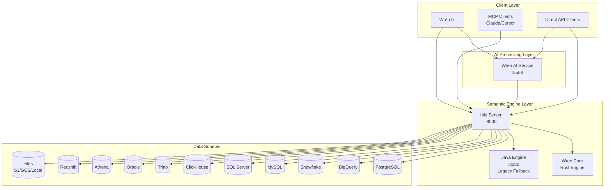
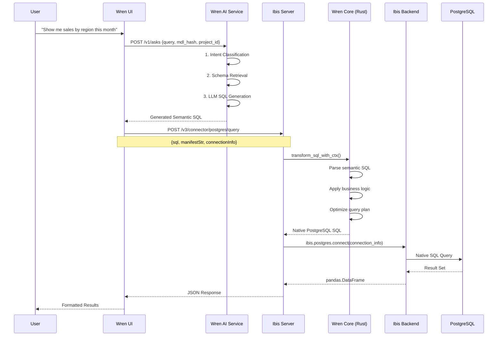
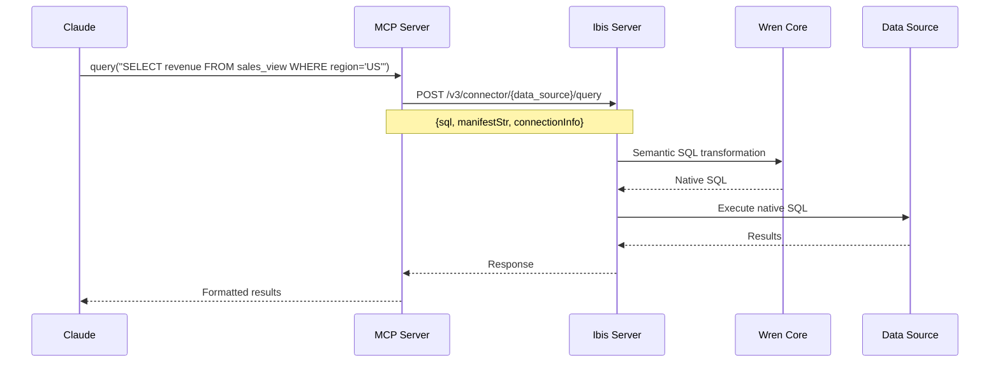

# Complete Data Source Connectivity Trace - Wren Architecture

## Overview

This document traces the complete data flow from client applications to actual data sources across the entire Wren ecosystem, showing how connection information flows through each service layer.

## 🏗️ Architecture Components



## 🔄 Complete Data Flow Trace

### 1. **Client → AI Service Flow (Natural Language Queries)**

#### **Step 1: User Request (Wren UI)**
```typescript
// wren-ui/src/pages/api/v1/generate_sql.ts
const response = await wrenAIAdaptor.ask({
  projectId: project.id,
  query: "Show me sales by region this month",
  threadId: threadId,
  configurations: { language: "EN" }
});
```

#### **Step 2: AI Service Processing**
```python
# wren-ai-service/src/web/v1/services/ask.py
@observe(name="Ask Service")
async def ask(self, ask_request: AskRequest, **kwargs):
    # Natural language understanding
    intent = await self._pipelines["intent_classification"].run(
        query=ask_request.query
    )
    
    # Schema retrieval & context building
    context = await self._pipelines["sql_generation"].run(
        query=ask_request.query,
        mdl=mdl_hash,
        project_id=project_id
    )
    
    # LLM SQL generation
    sql = await self._llm.generate_sql(
        question=ask_request.query,
        schema_context=context
    )
    
    return sql  # Returns semantic SQL
```

#### **Step 3: Engine Validation**
```python
# wren-ai-service/src/providers/engine/wren.py
@provider("wren_ibis")
class WrenIbis(Engine):
    async def execute_sql(self, sql: str, session: aiohttp.ClientSession, **kwargs):
        response = await session.post(
            f"{self._endpoint}/v3/connector/{self._source}/query?dry_run=true",
            json={
                "sql": sql,
                "manifestStr": self._manifest,
                "connectionInfo": self._connection_info,
            }
        )
        return response
```

### 2. **Client → Engine Flow (Direct Semantic Queries)**

#### **Step 1: MCP Client Request**
```python
# wren-engine/mcp-server/app/wren.py
@mcp.tool()
async def query(sql: str) -> str:
    """Query the Wren Engine with semantic SQL"""
    response = await make_query_request(sql)
    return response.text

async def make_query_request(sql: str, dry_run: bool = False):
    async with httpx.AsyncClient() as client:
        response = await client.post(
            f"http://{WREN_URL}/v3/connector/{data_source}/query?dry_run={dry_run}",
            json={
                "sql": sql,                    # Semantic SQL
                "manifestStr": mdl_base64,     # Business logic schema
                "connectionInfo": connection_info  # Data source credentials
            }
        )
        return response
```

#### **Step 2: Wren UI Direct Engine Access**
```typescript
// wren-ui/src/apollo/server/adaptors/ibisAdaptor.ts
export class IbisAdaptor implements IIbisAdaptor {
  async query(sql: string, options: IbisQueryOptions): Promise<IbisQueryResponse> {
    const ibisConnectionInfo = toIbisConnectionInfo(
      options.dataSource,
      options.connectionInfo
    );
    
    const response = await axios.post(
      `${this.endpoint}/v3/connector/${dataSourceUrlMap[options.dataSource]}/query`,
      {
        sql,
        manifestStr: base64Manifest,
        connectionInfo: ibisConnectionInfo,
        limit: options.limit || DEFAULT_PREVIEW_LIMIT
      }
    );
    
    return response.data;
  }
}
```

### 3. **Engine Processing & Data Source Connection**

#### **Step 1: Ibis Server Request Handling**
```python
# wren-engine/ibis-server/app/routers/v3/connector.py
@router.post("/{data_source}/query")
async def query(
    data_source: DataSource,
    dto: QueryDTO,
    dry_run: bool = False,
    limit: int | None = None,
):
    try:
        # 1. SQL Rewriting with Wren Core (Rust)
        rewritten_sql = await Rewriter(
            dto.manifest_str, 
            data_source=data_source, 
            experiment=True  # Use Rust engine
        ).rewrite(dto.sql)
        
        # 2. Create data source connector
        connector = Connector(data_source, dto.connection_info)
        
        # 3. Execute query
        if dry_run:
            connector.dry_run(rewritten_sql)
            return Response(status_code=204)
        else:
            result = connector.query(rewritten_sql, limit=limit)
            return ORJSONResponse(to_json(result))
            
    except Exception as e:
        # Fallback to Java engine
        return await v2.connector.query(data_source, dto, dry_run, ...)
```

#### **Step 2: Wren Core SQL Transformation**
```rust
// wren-engine/wren-core/core/src/mdl/mod.rs
pub async fn transform_sql_with_ctx(
    ctx: &SessionContext,
    analyzed_mdl: Arc<AnalyzedWrenMDL>,
    remote_functions: &[RemoteFunction],
    sql: &str,
) -> Result<String> {
    info!("wren-core received SQL: {}", sql);
    
    // Create semantic context with MDL
    let ctx = create_ctx_with_mdl(ctx, Arc::clone(&analyzed_mdl), false).await?;
    
    // Parse and optimize semantic SQL
    let plan = ctx.state().create_logical_plan(sql).await?;
    let analyzed = ctx.state().optimize(&plan)?;
    
    // Generate database-specific SQL
    let data_source = analyzed_mdl.wren_mdl().data_source().unwrap_or_default();
    let wren_dialect = WrenDialect::new(&data_source);
    let unparser = Unparser::new(&wren_dialect).with_pretty(true);
    
    match unparser.plan_to_sql(&analyzed) {
        Ok(sql) => {
            let native_sql = sql.to_string();
            info!("wren-core planned SQL: {}", native_sql);
            Ok(native_sql)
        }
        Err(e) => Err(e),
    }
}
```

#### **Step 3: Data Source Connection Factory**
```python
# wren-engine/ibis-server/app/model/connector.py
class Connector:
    def __init__(self, data_source: DataSource, connection_info: ConnectionInfo):
        # Route to appropriate connector based on data source
        if data_source == DataSource.mssql:
            self._connector = MSSqlConnector(connection_info)
        elif data_source == DataSource.canner:
            self._connector = CannerConnector(connection_info)
        elif data_source == DataSource.bigquery:
            self._connector = BigQueryConnector(connection_info)
        elif data_source in {DataSource.local_file, DataSource.s3_file, DataSource.minio_file, DataSource.gcs_file}:
            self._connector = DuckDBConnector(connection_info)
        else:
            self._connector = SimpleConnector(data_source, connection_info)

    def query(self, sql: str, limit: int) -> pd.DataFrame:
        return self._connector.query(sql, limit)
```

#### **Step 4: Data Source Specific Connections**
```python
# wren-engine/ibis-server/app/model/data_source.py
class DataSourceExtension(Enum):
    
    # PostgreSQL Connection
    @staticmethod
    def get_postgres_connection(info: PostgresConnectionInfo) -> BaseBackend:
        return ibis.postgres.connect(
            host=info.host.get_secret_value(),
            port=int(info.port.get_secret_value()),
            database=info.database.get_secret_value(),
            user=info.user.get_secret_value(),
            password=info.password.get_secret_value() if info.password else None,
        )
    
    # BigQuery Connection  
    @staticmethod
    def get_bigquery_connection(info: BigQueryConnectionInfo) -> BaseBackend:
        credits_json = loads(base64.b64decode(info.credentials.get_secret_value()).decode("utf-8"))
        credentials = service_account.Credentials.from_service_account_info(credits_json)
        return ibis.bigquery.connect(
            project_id=info.project_id.get_secret_value(),
            dataset_id=info.dataset_id.get_secret_value(),
            credentials=credentials,
        )
    
    # Snowflake Connection
    @staticmethod
    def get_snowflake_connection(info: SnowflakeConnectionInfo) -> BaseBackend:
        return ibis.snowflake.connect(
            user=info.user.get_secret_value(),
            password=info.password.get_secret_value(),
            account=info.account.get_secret_value(),
            database=info.database.get_secret_value(),
            schema=info.sf_schema.get_secret_value(),
        )
    
    # MySQL Connection
    @classmethod
    def get_mysql_connection(cls, info: MySqlConnectionInfo) -> BaseBackend:
        ssl_context = cls._create_ssl_context(info)
        kwargs = {"ssl": ssl_context} if ssl_context else {}
        kwargs.setdefault("charset", "utf8mb4")
        
        return ibis.mysql.connect(
            host=info.host.get_secret_value(),
            port=int(info.port.get_secret_value()),
            database=info.database.get_secret_value(),
            user=info.user.get_secret_value(),
            password=info.password.get_secret_value() if info.password else None,
            **kwargs,
        )
```

## 🗃️ Connection Information Flow

### **Connection Info Transformation Pipeline**

#### **1. UI Layer → Connection Encryption**
```typescript
// wren-ui/src/apollo/server/dataSource.ts
export function encryptConnectionInfo(
  dataSourceType: DataSourceName,
  connectionInfo: WREN_AI_CONNECTION_INFO,
) {
  return dataSource[dataSourceType].sensitiveProps.reduce((acc, prop: string) => {
    const value = connectionInfo[prop];
    if (value) {
      const encryption = encryptor.encrypt(
        JSON.parse(JSON.stringify({ [prop]: value }))
      );
      return { ...acc, [prop]: encryption };
    }
    return acc;
  }, connectionInfo);
}
```

#### **2. UI → Ibis Transformation**
```typescript
// Each data source has specific transformation logic
export function toIbisConnectionInfo(dataSourceType, connectionInfo) {
  return dataSource[dataSourceType].toIbisConnectionInfo(connectionInfo);
}

// Example: PostgreSQL
[DataSourceName.POSTGRES]: {
  sensitiveProps: ['password'],
  toIbisConnectionInfo(connectionInfo) {
    const { host, port, database, user, password, ssl } = 
      decryptConnectionInfo(DataSourceName.POSTGRES, connectionInfo);
    
    const encodedPassword = encodeURIComponent(password);
    let connectionUrl = `postgresql://${user}:${encodedPassword}@${host}:${port}/${database}?`;
    if (ssl) {
      connectionUrl += 'sslmode=require';
    }
    return { connectionUrl };
  }
}
```

#### **3. Engine Layer Connection Validation**
```python
# wren-engine/ibis-server/app/model/connector.py
class SimpleConnector:
    def __init__(self, data_source: DataSource, connection_info: ConnectionInfo):
        self.data_source = data_source
        # This creates the actual database connection
        self.connection = self.data_source.get_connection(connection_info)

    def query(self, sql: str, limit: int) -> pd.DataFrame:
        # Execute using Ibis backend
        return self.connection.sql(sql).limit(limit).to_pandas()

    def dry_run(self, sql: str) -> None:
        # Validate SQL without returning data
        self.connection.sql(sql)
```

## 📊 Supported Data Sources & Connection Details

### **Production Data Sources (14 total)**

| Data Source | Ibis Backend | Connection Method | SSL Support | Authentication |
|-------------|-------------|------------------|-------------|----------------|
| **PostgreSQL** | `ibis.postgres` | Direct connection | ✅ | Username/Password |
| **MySQL** | `ibis.mysql` | Direct connection | ✅ | Username/Password |
| **BigQuery** | `ibis.bigquery` | Service Account | ✅ | Service Account JSON |
| **Snowflake** | `ibis.snowflake` | Direct connection | ✅ | Username/Password |
| **SQL Server** | `ibis.mssql` | ODBC Driver | ✅ | Username/Password |
| **Oracle** | `ibis.oracle` | Direct connection | ✅ | Username/Password |
| **ClickHouse** | `ibis.clickhouse` | HTTP/Native | ✅ | Username/Password |
| **Trino** | `ibis.trino` | HTTP API | ✅ | Username/Password |
| **Athena** | `ibis.athena` | AWS SDK | ✅ | AWS Credentials |
| **Redshift** | `ibis.redshift` | PostgreSQL compatible | ✅ | Password/IAM |
| **Canner** | `ibis.postgres` | PostgreSQL protocol | ✅ | PAT Token |
| **DuckDB** | `ibis.duckdb` | In-memory/File | N/A | No authentication |
| **S3 Files** | DuckDB + S3 | S3 API | ✅ | AWS Credentials |
| **GCS Files** | DuckDB + GCS | GCS API | ✅ | Service Account |

### **Connection Info Models**

#### **PostgreSQL Example**
```python
# wren-engine/ibis-server/app/model/__init__.py
class PostgresConnectionInfo(BaseConnectionInfo):
    host: SecretStr = Field(examples=["localhost"])
    port: SecretStr = Field(examples=[5432])
    database: SecretStr = Field(examples=["postgres"])
    user: SecretStr = Field(examples=["postgres"])
    password: SecretStr | None = Field(examples=["password"], default=None)
```

#### **BigQuery Example**
```python
class BigQueryConnectionInfo(BaseConnectionInfo):
    project_id: SecretStr = Field(examples=["my-project"])
    dataset_id: SecretStr = Field(examples=["my_dataset"])
    credentials: SecretStr = Field(description="Service account JSON as base64")
```

#### **Snowflake Example**
```python
class SnowflakeConnectionInfo(BaseConnectionInfo):
    user: SecretStr = Field(examples=["snowflake_user"])
    password: SecretStr = Field(examples=["password"])
    account: SecretStr = Field(examples=["xy12345.snowflakecomputing.com"])
    database: SecretStr = Field(examples=["ANALYTICS"])
    sf_schema: SecretStr = Field(alias="schema", examples=["PUBLIC"])
```

## 🔄 Complete Request Flow Example

### **Natural Language Query → Database Result**



### **MCP Client Direct Query**



## 🔧 Configuration & Environment Variables

### **Ibis Server Environment Variables**
```bash
# wren-engine/ibis-server/.env
WREN_ENGINE_ENDPOINT=http://localhost:8080  # Java engine fallback
WREN_RUST_VERSION=true                      # Enable Rust engine
LOG_LEVEL=INFO
REMOTE_FUNCTION_LIST_PATH=/app/functions    # Custom functions
```

### **MCP Server Environment Variables**
```bash
# wren-engine/mcp-server/.env
WREN_URL=localhost:8000                     # Ibis server endpoint
MDL_PATH=/path/to/schema.json              # Semantic model
CONNECTION_INFO_FILE=/path/to/connection.json  # Data source credentials
```

### **AI Service Environment Variables**
```bash
# wren-ai-service/.env.dev
WREN_IBIS_ENDPOINT=http://localhost:8000   # Engine endpoint
WREN_IBIS_SOURCE=postgres                  # Default data source
WREN_IBIS_CONNECTION_INFO=base64_encoded   # Connection credentials
LLM_OPENAI_API_KEY=your_api_key           # AI processing
```

## 🚨 Error Handling & Fallbacks

### **Engine Fallback Strategy**
```python
# V3 (Rust) → V2 (Java) Fallback
try:
    # Try Rust-powered engine
    rewritten_sql = await Rewriter(
        dto.manifest_str, 
        data_source=data_source, 
        experiment=True
    ).rewrite(dto.sql)
except Exception as e:
    logger.warning("Failed to execute v3 query, fallback to v2: {}", str(e))
    # Fallback to Java engine
    return await v2.connector.query(
        data_source, dto, dry_run, cache_enable, override_cache, limit,
        java_engine_connector, query_cache_manager, headers,
    )
```

### **Connection Error Handling**
```python
# wren-engine/ibis-server/app/model/connector.py
try:
    result = self.connection.sql(sql).limit(limit).to_pandas()
    return result
except Exception as e:
    if "connection" in str(e).lower():
        raise ConnectionError(f"Failed to connect to {self.data_source}: {e}")
    elif "authentication" in str(e).lower():
        raise AuthenticationError(f"Authentication failed for {self.data_source}: {e}")
    else:
        raise UnknownIbisError(f"Query execution failed: {e}")
```

## 📈 Performance & Optimization

### **Connection Pooling**
```python
# Ibis handles connection pooling automatically
# Each connector maintains connection state
class SimpleConnector:
    def __init__(self, data_source: DataSource, connection_info: ConnectionInfo):
        # Connection is created once and reused
        self.connection = self.data_source.get_connection(connection_info)
```

### **Query Caching**
```python
# wren-engine/ibis-server/app/routers/v3/connector.py
if cache_enable:
    cached_result = query_cache_manager.get(
        data_source, dto.sql, dto.connection_info
    )
    if cached_result:
        return ORJSONResponse(to_json(cached_result))
```

### **SQL Optimization**
```rust
// Wren Core applies multiple optimization passes
let plan = ctx.state().create_logical_plan(sql).await?;
let analyzed = ctx.state().optimize(&plan)?;  // DataFusion optimizations

// Includes:
// - Predicate pushdown
// - Join optimization
// - Column pruning
// - Constant folding
```

## 🎯 Summary

The data source connectivity in Wren follows this **critical path**:

1. **Connection Configuration**: Stored encrypted in Wren UI, decrypted and transformed for each target service
2. **API Layer**: Ibis Server acts as the universal data access layer with 14+ data source connectors  
3. **Semantic Processing**: Wren Core (Rust) transforms business SQL to database-native SQL
4. **Execution**: Ibis backends handle the actual database connections and query execution
5. **Fallback**: Java engine provides backward compatibility for complex cases

The key insight is that **Ibis Server is the central hub** for all data source connectivity, while Wren Core handles the semantic intelligence, and the AI Service adds natural language understanding on top.
