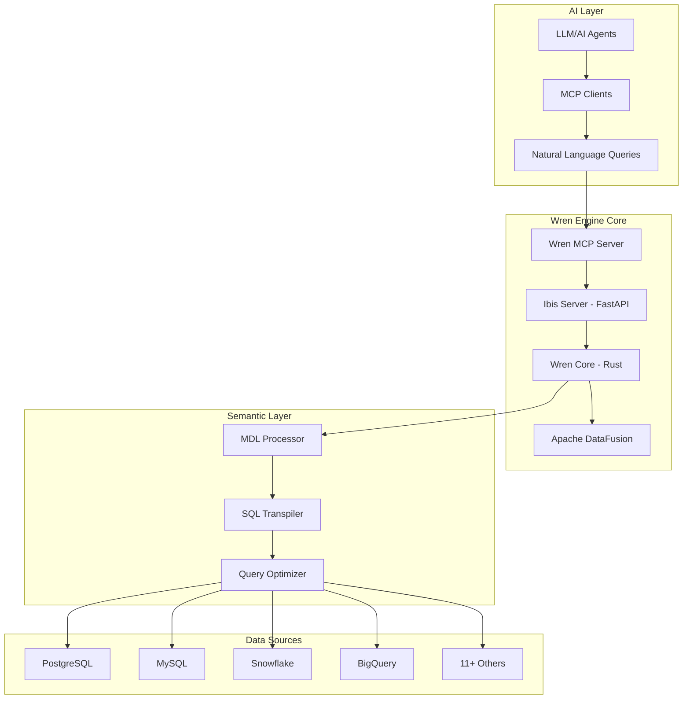
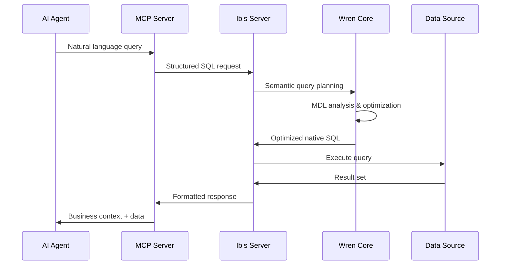

# Wren Engine - Complete Architecture & Working Guide

## Table of Contents
1. [Overview](#overview)
2. [Core Architecture](#core-architecture)
3. [Module Deep Dive](#module-deep-dive)
4. [Semantic Layer Implementation](#semantic-layer-implementation)
5. [Data Processing Pipeline](#data-processing-pipeline)
6. [API Architecture](#api-architecture)
7. [Integration Patterns](#integration-patterns)
8. [Performance & Optimization](#performance--optimization)
9. [Security & Governance](#security--governance)
10. [Development & Deployment](#development--deployment)

## Overview

Wren Engine is a **semantic engine** designed to power the next generation of AI agents and MCP (Model Context Protocol) clients. It serves as the foundation for enterprise data interactions, providing a sophisticated semantic layer that enables AI systems to understand and query business data with accuracy, context, and governance.

### Mission Statement
> **"Power the future of MCP clients and AI agents through context-aware, composable systems"**

### Key Value Propositions
- 🔌 **Embeddable** into any MCP client or AI agentic workflow
- 🔄 **Interoperable** with modern data stacks (PostgreSQL, MySQL, Snowflake, etc.)
- 🧠 **Semantic-first**, enabling AI to "understand" data models and business logic
- 🔐 **Governance-ready**, respecting roles, access controls, and definitions

## Core Architecture

### High-Level System Design



### 4 Main Modules

1. **[ibis-server](./ibis-server/)**: Web server powered by FastAPI and Ibis
2. **[wren-core](./wren-core)**: Semantic core written in Rust with Apache DataFusion
3. **[wren-core-py](./wren-core-py)**: Python bindings for wren-core
4. **[mcp-server](./mcp-server/)**: MCP server powered by MCP Python SDK

## Module Deep Dive

### 1. Wren Core (Rust) - The Semantic Engine

**Location**: `wren-engine/wren-core/`
**Technology**: Rust + Apache DataFusion
**Purpose**: Core semantic processing and SQL transformation

#### Key Components

##### **MDL (Modeling Definition Language) Processor**
```rust
// Core MDL analysis structure
pub struct AnalyzedWrenMDL {
    pub wren_mdl: Arc<WrenMDL>,
    pub datasets: HashMap<String, Dataset>,
    pub qualified_references: HashMap<Column, ColumnReference>,
    pub remote_functions: HashMap<String, RemoteFunction>,
}

impl AnalyzedWrenMDL {
    pub fn analyze(manifest: Manifest) -> Result<Self> {
        // Semantic analysis of business models
        // Relationship detection and validation
        // Column reference mapping
    }
}
```

**Capabilities:**
- **Semantic Analysis**: Understands business models, relationships, and calculated fields
- **Query Planning**: Transforms semantic queries into optimized SQL
- **Model Validation**: Ensures data model consistency and integrity
- **Relationship Mapping**: Auto-detects and validates table relationships

##### **Context Management**
```rust
// Wren-specific data source abstraction
pub struct WrenDataSource {
    schema: SchemaRef,
}

// Session context with MDL integration
pub async fn create_ctx_with_mdl(
    ctx: &SessionContext,
    analyzed_mdl: Arc<AnalyzedWrenMDL>,
    is_local_runtime: bool,
) -> Result<SessionContext> {
    // Apply Wren-specific analyzer rules
    // Register semantic tables
    // Configure optimization rules
}
```

##### **SQL Transformation Engine**
```rust
// Main transformation function
pub async fn transform_sql_with_ctx(
    ctx: &SessionContext,
    analyzed_mdl: Arc<AnalyzedWrenMDL>,
    session_properties: &[String],
    sql: &str,
) -> Result<String> {
    // Parse semantic SQL
    // Apply business logic
    // Generate optimized native SQL
}
```

#### Supported Features

**Data Types & Operations**:
- Complex data types (structs, arrays, nested objects)
- Window functions and aggregations
- Time-series operations
- JSON/semi-structured data handling

**Business Logic**:
- Calculated fields with business formulas
- Multi-table relationships and joins
- Row-level security policies
- Data governance rules

**Query Optimization**:
- Predicate pushdown
- Join optimization
- Column pruning
- Constant folding

### 2. Ibis Server (Python) - API Gateway

**Location**: `wren-engine/ibis-server/`
**Technology**: FastAPI + Ibis + Python
**Purpose**: RESTful API server and data source connectivity

#### Architecture Overview
```python
# Main server application
class WrenIbis(Engine):
    def __init__(self,
        endpoint: str,
        source: str,
        manifest: str,
        connection_info: str
    ):
        self._endpoint = endpoint
        self._source = source
        self._manifest = manifest
        self._connection_info = connection_info

    async def execute_sql(self,
        sql: str,
        session: aiohttp.ClientSession,
        dry_run: bool = True,
        timeout: float = 30.0,
        limit: int = 500,
        **kwargs
    ) -> Tuple[bool, Optional[Dict[str, Any]]]:
        # Execute queries via ibis connectors
        # Handle connection pooling
        # Manage query lifecycle
```

#### Key Responsibilities

**API Endpoints**:
- `/v3/connector/{data_source}/query` - Execute queries
- `/v3/connector/{data_source}/dry-run` - Validate queries
- `/v3/metadata/{data_source}/tables` - Discover schema
- `/v3/connector/{data_source}/function` - List functions

**Data Source Management**:
```python
class DataSource(StrEnum):
    bigquery = auto()
    postgres = auto()
    mysql = auto()
    snowflake = auto()
    trino = auto()
    # ... 11+ total data sources

class DataSourceExtension(Enum):
    def get_connection(self, info: ConnectionInfo) -> BaseBackend:
        # Dynamic connection creation
        # Connection pooling
        # Error handling
```

**Query Processing Pipeline**:
1. **Request Validation**: Validate SQL and connection info
2. **Wren Core Integration**: Send to Rust core for planning
3. **SQL Execution**: Execute via Ibis connectors
4. **Response Formatting**: Return structured results

#### Supported Data Sources (11+)
- **Cloud**: BigQuery, Snowflake, Redshift, Athena
- **Databases**: PostgreSQL, MySQL, Oracle, SQL Server, ClickHouse
- **Analytics**: Trino, DuckDB
- **Files**: Local files, S3, GCS, Minio

### 3. MCP Server - AI Agent Interface

**Location**: `wren-engine/mcp-server/`
**Technology**: Python + MCP SDK
**Purpose**: Model Context Protocol integration for AI agents

#### Core Functionality
```python
# MCP tool definitions for AI agents
@server.call_tool()
async def query_data(sql: str) -> List[List[Any]]:
    """Execute SQL query against the semantic layer"""
    # Validate SQL through Wren Engine
    # Execute via Ibis server
    # Return structured results

@server.call_tool()
async def describe_table(table_name: str) -> Dict[str, Any]:
    """Get table schema and business context"""
    # Return semantic model information
    # Include business descriptions
    # Provide relationship context
```

#### Integration Patterns
- **Claude Integration**: Direct MCP client connection
- **Cursor/Cline**: Development environment integration
- **Custom Agents**: Extensible tool framework
- **Zapier Workflows**: Business process automation

### 4. Legacy Wren Core (Java) - Backwards Compatibility

**Location**: `wren-engine/wren-core-legacy/`
**Technology**: Java + Trino Parser
**Purpose**: Fallback processing for complex queries

#### Migration Strategy
- **V3 API**: Rust implementation (primary)
- **V2 API**: Java implementation (fallback)
- **Gradual Migration**: Query-by-query optimization

## Semantic Layer Implementation

### MDL (Modeling Definition Language)

#### Model Definition Structure
```json
{
  "catalog": "wren",
  "schema": "public",
  "models": [
    {
      "name": "customers",
      "tableReference": "public.customers",
      "columns": [
        {
          "name": "customer_id",
          "type": "varchar",
          "expression": "id"
        },
        {
          "name": "full_name",
          "type": "varchar",
          "expression": "first_name || ' ' || last_name"
        },
        {
          "name": "lifetime_value",
          "type": "decimal",
          "expression": "SELECT SUM(amount) FROM orders WHERE customer_id = customers.id"
        }
      ],
      "primaryKey": "customer_id"
    }
  ],
  "relationships": [
    {
      "name": "customers_orders",
      "models": ["customers", "orders"],
      "joinType": "ONE_TO_MANY",
      "condition": "customers.customer_id = orders.customer_id"
    }
  ]
}
```

#### Business Logic Capabilities

**Calculated Fields**:
```sql
-- Business metrics as calculated fields
revenue_per_customer: "total_revenue / customer_count"
churn_rate: "churned_customers / total_customers * 100"
growth_rate: "(current_period - previous_period) / previous_period * 100"
```

**Relationship Management**:
```rust
// Automatic relationship detection
pub enum JoinType {
    OneToOne,
    OneToMany,
    ManyToOne,
    ManyToMany,
}

pub struct Relationship {
    pub name: String,
    pub models: Vec<String>,
    pub join_type: JoinType,
    pub condition: String,
}
```

**Row-Level Security**:
```sql
-- Example: Multi-tenant access control
WHERE tenant_id = ${SESSION.tenant_id}
  AND (role = 'admin' OR user_id = ${SESSION.user_id})
```

### Query Transformation Process

#### Step 1: Semantic Analysis
```rust
// Parse business-friendly SQL
"SELECT customer_name, lifetime_value FROM customers WHERE region = 'US'"

// Analyze semantic meaning
// - customer_name maps to calculated field
// - lifetime_value is a complex calculation
// - region is a simple column reference
```

#### Step 2: Model Resolution
```rust
// Resolve to physical schema
"SELECT 
    first_name || ' ' || last_name AS customer_name,
    (SELECT SUM(amount) FROM orders WHERE customer_id = c.id) AS lifetime_value
FROM customers c 
WHERE region = 'US'"
```

#### Step 3: Optimization
```rust
// Apply DataFusion optimizations
// - Predicate pushdown
// - Join optimization  
// - Column pruning
// - Subquery optimization
```

#### Step 4: Native SQL Generation
```sql
-- Final optimized SQL for target database
SELECT 
    CONCAT(c.first_name, ' ', c.last_name) AS customer_name,
    COALESCE(o.total_amount, 0) AS lifetime_value
FROM customers c
LEFT JOIN (
    SELECT customer_id, SUM(amount) as total_amount 
    FROM orders 
    GROUP BY customer_id
) o ON c.id = o.customer_id
WHERE c.region = 'US'
```

## Data Processing Pipeline

### Query Execution Flow



### Performance Characteristics

**Query Planning**: ~10-50ms
- MDL analysis and validation
- Semantic to physical mapping
- Query optimization

**SQL Transpilation**: ~5-20ms
- DataFusion query planning
- Dialect-specific generation
- Optimization rule application

**Query Execution**: Variable (data-dependent)
- Depends on data source performance
- Connection pooling optimization
- Result set processing

## API Architecture

### RESTful API Design

#### V3 API (Current - Rust-powered)
```http
POST /v3/connector/{data_source}/query
Content-Type: application/json

{
  "sql": "SELECT * FROM customers WHERE region = 'US'",
  "manifestStr": "base64_encoded_mdl",
  "connectionInfo": {
    "host": "localhost",
    "port": 5432,
    "database": "analytics",
    "user": "wren_user"
  },
  "limit": 1000
}
```

#### Response Format
```json
{
  "data": [
    ["John Doe", "US", 1250.00],
    ["Jane Smith", "US", 2100.00]
  ],
  "columns": [
    {"name": "customer_name", "type": "varchar"},
    {"name": "region", "type": "varchar"}, 
    {"name": "lifetime_value", "type": "decimal"}
  ],
  "metadata": {
    "rowCount": 2,
    "executionTime": "45ms",
    "queryId": "uuid-here"
  }
}
```

### Adapter Pattern for Data Sources

#### Wren Engine Adapter (UI Integration)
```typescript
export class WrenEngineAdaptor implements IWrenEngineAdaptor {
  private readonly wrenEngineBaseEndpoint: string;

  public async previewData(
    sql: string,
    manifest: Manifest,
    limit: number = 1000
  ): Promise<EngineQueryResponse> {
    const response = await axios.post(
      `${this.wrenEngineBaseEndpoint}/v1/mdl/preview`,
      {
        sql,
        manifest,
        limit
      }
    );
    return response.data;
  }

  public async validateColumnIsValid(
    manifest: Manifest,
    modelName: string,
    columnName: string
  ): Promise<WrenEngineValidationResponse> {
    // Semantic validation logic
  }
}
```

#### Provider Pattern (AI Service Integration)
```python
@provider("wren_engine")
class WrenEngine(Engine):
    def __init__(self,
        endpoint: str = os.getenv("WREN_ENGINE_ENDPOINT"),
        manifest: str = os.getenv("WREN_ENGINE_MANIFEST")
    ):
        self._endpoint = endpoint
        self._manifest = manifest

    async def execute_sql(self,
        sql: str,
        session: aiohttp.ClientSession,
        **kwargs
    ) -> Tuple[bool, Optional[Dict[str, Any]], Optional[str]]:
        # Execute via Wren Engine API
        # Handle errors and retries
        # Return structured results
```

## Integration Patterns

### 1. MCP Client Integration

#### Claude Integration Example
```python
# MCP server tools for Claude
@server.call_tool()
async def analyze_sales_data(time_period: str, region: str) -> Dict[str, Any]:
    """Analyze sales performance for a specific period and region"""
    
    sql = f"""
    SELECT 
        DATE_TRUNC('month', order_date) as month,
        region,
        SUM(revenue) as total_revenue,
        COUNT(DISTINCT customer_id) as unique_customers,
        AVG(order_value) as avg_order_value
    FROM sales_view 
    WHERE order_date >= '{time_period}'
      AND region = '{region}'
    GROUP BY 1, 2
    ORDER BY 1
    """
    
    return await execute_semantic_query(sql)
```

#### Cursor/Cline Integration
```typescript
// Wren Engine MCP tools for development environments
const wrenTools = {
  query_business_data: {
    description: "Query business data using semantic layer",
    parameters: {
      query: { type: "string", description: "Business question in SQL" },
      context: { type: "string", description: "Business context" }
    }
  },
  
  explore_data_model: {
    description: "Explore available data models and relationships",
    parameters: {
      domain: { type: "string", description: "Business domain to explore" }
    }
  }
};
```

### 2. Enterprise Data Stack Integration

#### dbt Integration
```yaml
# dbt model with Wren Engine
version: 2

models:
  - name: customer_metrics
    description: "Customer business metrics powered by Wren Engine"
    config:
      materialized: view
      wren_engine:
        semantic_layer: true
        calculated_fields:
          - lifetime_value
          - churn_probability
          - segment_classification
```

#### BI Tool Integration
```sql
-- Power BI / Tableau connection via Wren Engine
-- Semantic layer provides business-friendly field names
-- Automatic relationship detection
-- Calculated measures available as columns

SELECT 
    customer_segment,        -- Semantic field
    monthly_recurring_revenue,  -- Calculated field
    churn_risk_score,       -- ML model output
    customer_satisfaction   -- Survey data integration
FROM customer_360_view
WHERE active_status = true
```

### 3. AI Agent Workflows

#### Automated Reporting Agent
```python
class ReportingAgent:
    def __init__(self, wren_client):
        self.wren = wren_client
    
    async def generate_weekly_report(self):
        # Executive summary
        kpis = await self.wren.query("""
            SELECT 
                total_revenue,
                new_customers,
                churn_rate,
                avg_order_value
            FROM weekly_kpis 
            WHERE week = CURRENT_WEEK()
        """)
        
        # Trend analysis
        trends = await self.wren.query("""
            SELECT 
                metric_name,
                current_value,
                previous_value,
                percentage_change
            FROM metric_trends
            WHERE period = 'week'
        """)
        
        return self.format_executive_report(kpis, trends)
```

## Performance & Optimization

### Query Performance Optimization

#### 1. Semantic Caching
```rust
// Cache semantic query plans
pub struct SemanticCache {
    query_plans: HashMap<String, LogicalPlan>,
    mdl_cache: HashMap<String, AnalyzedWrenMDL>,
}

impl SemanticCache {
    pub fn get_cached_plan(&self, sql: &str, mdl_hash: &str) -> Option<&LogicalPlan> {
        // Return cached execution plan
        // Avoid re-analysis of identical semantic queries
    }
}
```

#### 2. Connection Pooling
```python
# Ibis server connection management
class ConnectionPool:
    def __init__(self, data_source: DataSource, config: ConnectionConfig):
        self.pool = create_connection_pool(
            min_connections=config.min_pool_size,
            max_connections=config.max_pool_size,
            connection_timeout=config.timeout
        )
    
    async def execute_query(self, sql: str) -> QueryResult:
        async with self.pool.acquire() as conn:
            return await conn.execute(sql)
```

#### 3. Predicate Pushdown
```rust
// Optimize queries by pushing filters down
fn optimize_predicate_pushdown(plan: LogicalPlan) -> LogicalPlan {
    // Move WHERE clauses closer to data sources
    // Reduce data movement between processing layers
    // Leverage database-native optimization
}
```

### Scalability Patterns

#### Horizontal Scaling
- **Stateless API servers**: Multiple Ibis server instances
- **Load balancing**: Route queries based on data source
- **Connection pooling**: Shared connection pools across instances

#### Vertical Scaling
- **Memory optimization**: Efficient MDL caching
- **CPU optimization**: Parallel query processing
- **I/O optimization**: Async query execution

## Security & Governance

### Access Control Framework

#### Row-Level Security
```sql
-- Automatic security policy injection
-- Original query
SELECT * FROM customer_data WHERE region = 'US'

-- With RLS applied
SELECT * FROM customer_data 
WHERE region = 'US' 
  AND tenant_id = ${SESSION.tenant_id}
  AND (user_role = 'admin' OR assigned_territories CONTAINS region)
```

#### Column-Level Security
```rust
// Sensitive field masking
pub struct SecurityPolicy {
    pub masked_columns: Vec<String>,
    pub access_roles: Vec<String>,
}

impl SecurityPolicy {
    pub fn apply_column_masking(&self, query: &str, user_role: &str) -> String {
        // Mask PII fields based on user role
        // Apply encryption for sensitive data
        // Audit access patterns
    }
}
```

### Data Governance

#### Lineage Tracking
```rust
// Automatic data lineage capture
pub struct DataLineage {
    pub source_tables: Vec<String>,
    pub transformations: Vec<String>,
    pub calculated_fields: Vec<String>,
    pub query_path: Vec<String>,
}

impl DataLineage {
    pub fn track_query_lineage(&self, sql: &str) -> LineageGraph {
        // Build dependency graph
        // Track data flow
        // Enable impact analysis
    }
}
```

#### Audit & Compliance
```python
# Query audit logging
class AuditLogger:
    def log_query_execution(self,
        user_id: str,
        query: str,
        data_sources: List[str],
        result_count: int,
        execution_time: float
    ):
        audit_event = {
            "timestamp": datetime.utcnow(),
            "user_id": user_id,
            "query_hash": hashlib.sha256(query.encode()).hexdigest(),
            "data_sources": data_sources,
            "result_count": result_count,
            "execution_time_ms": execution_time,
            "compliance_tags": self.extract_compliance_tags(query)
        }
        
        self.audit_store.log(audit_event)
```

## Development & Deployment

### Development Environment Setup

#### Local Development
```bash
# 1. Clone repository
git clone https://github.com/Canner/wren-engine.git
cd wren-engine

# 2. Setup Rust environment
curl --proto '=https' --tlsv1.2 -sSf https://sh.rustup.rs | sh
rustup update

# 3. Setup Python environment
cd ibis-server
poetry install

# 4. Start development services
docker compose up -d  # Java engine for fallback
just run              # Start Ibis server

# 5. Run tests
cd ../wren-core
cargo test
```

#### Testing Strategy
```rust
// Wren Core unit tests
#[cfg(test)]
mod tests {
    #[tokio::test]
    async fn test_semantic_query_transformation() {
        let manifest = create_test_manifest();
        let analyzed_mdl = Arc::new(AnalyzedWrenMDL::analyze(manifest)?);
        
        let input_sql = "SELECT customer_name, lifetime_value FROM customers";
        let expected_sql = "SELECT CONCAT(first_name, ' ', last_name) AS customer_name, ...";
        
        let actual_sql = transform_sql_with_ctx(
            &SessionContext::new(),
            analyzed_mdl,
            &[],
            input_sql
        ).await?;
        
        assert_eq!(actual_sql, expected_sql);
    }
}
```

### Production Deployment

#### Docker Deployment
```yaml
# docker-compose.yml for production
services:
  wren-ibis:
    image: ghcr.io/canner/wren-engine-ibis:latest
    environment:
      - WREN_ENGINE_ENDPOINT=http://wren-engine:8080
      - WREN_RUST_VERSION=true
    ports:
      - "8000:8000"
    
  wren-engine:
    image: ghcr.io/canner/wren-engine:latest
    environment:
      - NODE_ENVIRONMENT=production
    volumes:
      - ./config:/usr/src/app/etc
    expose:
      - "8080"

  wren-mcp:
    image: ghcr.io/canner/wren-mcp-server:latest
    environment:
      - WREN_URL=http://wren-ibis:8000
      - MDL_PATH=/app/mdl/schema.json
    volumes:
      - ./mdl:/app/mdl
```

#### Kubernetes Deployment
```yaml
apiVersion: apps/v1
kind: Deployment
metadata:
  name: wren-engine
spec:
  replicas: 3
  selector:
    matchLabels:
      app: wren-engine
  template:
    metadata:
      labels:
        app: wren-engine
    spec:
      containers:
      - name: ibis-server
        image: ghcr.io/canner/wren-engine-ibis:latest
        ports:
        - containerPort: 8000
        env:
        - name: WREN_ENGINE_ENDPOINT
          value: "http://wren-core:8080"
        resources:
          limits:
            memory: "2Gi"
            cpu: "1000m"
          requests:
            memory: "1Gi"
            cpu: "500m"
```

### Monitoring & Observability

#### Metrics Collection
```python
# OpenTelemetry integration
from opentelemetry import trace, metrics

tracer = trace.get_tracer(__name__)
meter = metrics.get_meter(__name__)

query_duration = meter.create_histogram(
    "wren_query_duration_seconds",
    description="Query execution duration"
)

query_counter = meter.create_counter(
    "wren_queries_total",
    description="Total number of queries executed"
)

@tracer.start_as_current_span("execute_semantic_query")
async def execute_query(sql: str):
    start_time = time.time()
    
    try:
        result = await wren_engine.execute(sql)
        query_counter.add(1, {"status": "success", "data_source": result.source})
        return result
    except Exception as e:
        query_counter.add(1, {"status": "error", "error_type": type(e).__name__})
        raise
    finally:
        duration = time.time() - start_time
        query_duration.record(duration)
```

#### Health Checks
```python
# Health check endpoints
@app.get("/health")
async def health_check():
    checks = {
        "wren_core": await check_wren_core_health(),
        "data_sources": await check_data_source_connections(),
        "mdl_cache": check_mdl_cache_status()
    }
    
    overall_status = "healthy" if all(checks.values()) else "unhealthy"
    
    return {
        "status": overall_status,
        "checks": checks,
        "timestamp": datetime.utcnow().isoformat()
    }
```

## Conclusion

Wren Engine represents a sophisticated semantic engine that bridges the gap between AI agents and enterprise data systems. Through its multi-layered architecture, semantic modeling capabilities, and comprehensive API design, it enables AI systems to understand and interact with business data in a context-aware, governed manner.

### Key Strengths

1. **Semantic Understanding**: Native support for business logic and calculated fields
2. **Multi-Source Support**: 11+ data source connectors with unified interface
3. **Performance Optimization**: Rust-powered core with Apache DataFusion
4. **AI-First Design**: Built specifically for AI agent integration
5. **Enterprise Ready**: Security, governance, and audit capabilities

### Future Roadmap

- **Enhanced AI Integration**: More sophisticated natural language processing
- **Extended Data Source Support**: Additional connectors and protocols
- **Advanced Governance**: Fine-grained access controls and policy engines
- **Performance Optimization**: Further query optimization and caching
- **Cloud-Native Features**: Kubernetes operators and cloud integrations

The engine serves as a critical foundation for the next generation of AI-powered data applications, enabling enterprises to safely and effectively leverage AI for data-driven decision making.
