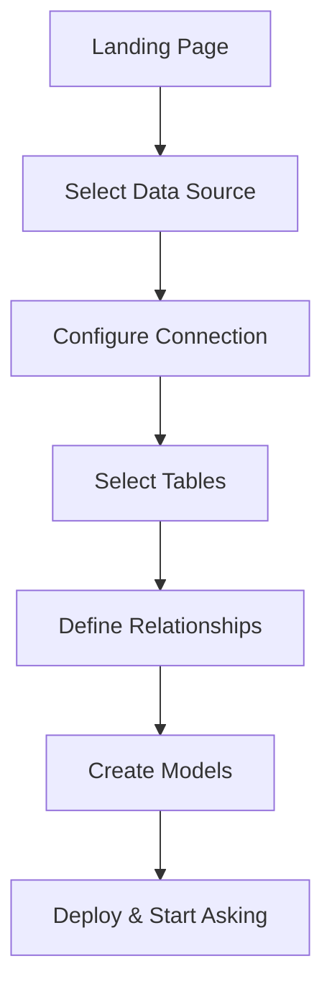
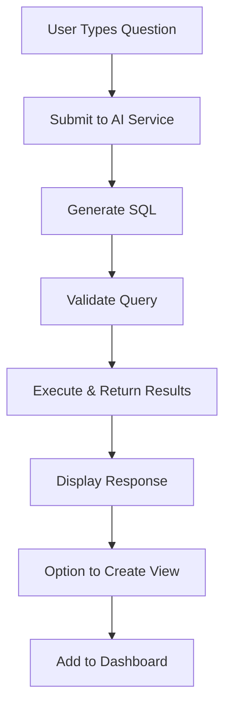
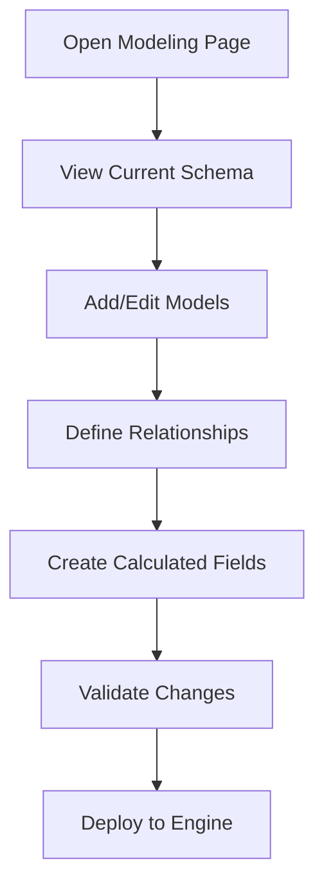

# Wren UI Pages - Complete Architecture Guide

## Table of Contents
1. [Overview](#overview)
2. [Application Architecture](#application-architecture)
3. [Page Structure](#page-structure)
4. [Core Pages Analysis](#core-pages-analysis)
5. [Component Ecosystem](#component-ecosystem)
6. [State Management](#state-management)
7. [API Integration](#api-integration)
8. [User Workflows](#user-workflows)
9. [Technical Implementation](#technical-implementation)

## Overview

Wren UI is a sophisticated Next.js-based web application that provides a complete interface for data modeling, natural language querying, and business intelligence. Built with React, TypeScript, and Apollo GraphQL, it serves as the primary user interface for the WrenAI ecosystem.

### Key Technologies
- **Next.js 14**: React framework with API routes
- **TypeScript**: Type-safe development
- **Apollo GraphQL**: Data fetching and state management
- **Ant Design**: UI component library
- **React Flow**: Interactive diagrams
- **Vega-Lite**: Data visualization
- **PostHog**: Analytics and telemetry

## Application Architecture

### Core Structure
```
wren-ui/
├── src/
│   ├── pages/           # Next.js pages (routing)
│   ├── components/      # Reusable UI components
│   ├── apollo/         # GraphQL client/server
│   ├── hooks/          # Custom React hooks
│   ├── utils/          # Utility functions
│   └── styles/         # Global styles
├── migrations/         # Database migrations
├── e2e/               # End-to-end tests
└── public/            # Static assets
```

### Application Entry Point (`_app.tsx`)
```tsx
function App({ Component, pageProps }: AppProps) {
  return (
    <>
      <Head>
        <title>Wren AI</title>
        <link rel="icon" href="/favicon.ico" />
      </Head>
      <GlobalConfigProvider>
        <ApolloProvider client={apolloClient}>
          <PostHogProvider client={posthog}>
            <main className="app">
              <Component {...pageProps} />
            </main>
          </PostHogProvider>
        </ApolloProvider>
      </GlobalConfigProvider>
    </>
  );
}
```

**Key Features:**
- **Global Configuration Management**: Centralized config context
- **Apollo GraphQL Integration**: Full-stack GraphQL implementation
- **Analytics Integration**: PostHog for user behavior tracking
- **Type Safety**: Complete TypeScript coverage

## Page Structure

### 1. **Landing Page** (`index.tsx`)
**Purpose**: Entry point and project selection
**Key Features:**
- Project initialization
- Sample dataset selection
- Onboarding flow
- Quick start guidance

### 2. **Home Page** (`home/index.tsx`)
**Purpose**: AI-powered query interface
**Core Functionality:**
```tsx
const Home = () => {
  const { sampleQuestions, onSelect } = useAskPrompt();
  const { suggestedQuestions } = useSuggestedQuestionsQuery();
  
  return (
    <SiderLayout>
      <Prompt onSubmit={handleAskQuestion} />
      <RecommendedQuestions questions={suggestedQuestions} />
      <PromptThread threadId={currentThread} />
    </SiderLayout>
  );
};
```

**Key Components:**
- **Natural Language Interface**: Text input for questions
- **Suggested Questions**: AI-generated recommendations
- **Thread Management**: Conversation history
- **Real-time Results**: Streaming query responses

### 3. **Modeling Page** (`modeling.tsx`)
**Purpose**: Visual data modeling and schema management
**Core Features:**
```tsx
const Modeling = () => {
  const { diagram } = useDiagramQuery();
  const [createModel] = useCreateModelMutation();
  const [updateModel] = useUpdateModelMutation();
  
  return (
    <ModelingLayout>
      <DiagramCanvas 
        models={diagram.models}
        views={diagram.views}
        onModelCreate={createModel}
        onModelUpdate={updateModel}
      />
      <PropertiesPanel model={selectedModel} />
    </ModelingLayout>
  );
};
```

**Capabilities:**
- **Visual Schema Designer**: Drag-and-drop modeling
- **Relationship Management**: Define table relationships
- **Calculated Fields**: Create business logic
- **Model Deployment**: Deploy changes to engine

### 4. **Setup Pages** (`setup/`)
**Purpose**: Initial configuration and data source connection

#### Setup Flow:
1. **Data Source Selection** (`setup/index.tsx`)
2. **Connection Configuration** (`setup/connection.tsx`)
3. **Table Selection** (`setup/tables.tsx`)
4. **Relationship Definition** (`setup/relationships.tsx`)
5. **Model Creation** (`setup/models.tsx`)

### 5. **Knowledge Management** (`knowledge/`)
**Purpose**: Manage AI training data and instructions

**Components:**
- **SQL Pairs Management**: Question-SQL training examples
- **Custom Instructions**: Business context for AI
- **Learning Records**: AI improvement tracking

### 6. **API Management** (`api-management/`)
**Purpose**: Monitor and manage API usage

**Features:**
- **API History**: Track all API calls
- **Performance Metrics**: Response times and success rates
- **Error Monitoring**: Failed request analysis
- **Usage Analytics**: API consumption patterns

## Core Pages Analysis

### Home Page Deep Dive

#### **Prompt Interface**
```tsx
// Main query interface
const Prompt = ({ onSubmit }) => {
  const [query, setQuery] = useState('');
  const [isLoading, setIsLoading] = useState(false);
  
  const handleSubmit = async () => {
    setIsLoading(true);
    const result = await askQuestion(query);
    onSubmit(result);
    setIsLoading(false);
  };
  
  return (
    <div className="prompt-container">
      <TextArea 
        value={query}
        onChange={setQuery}
        placeholder="Ask me anything about your data..."
      />
      <Button onClick={handleSubmit} loading={isLoading}>
        Ask
      </Button>
    </div>
  );
};
```

#### **Thread Management**
```tsx
// Conversation history
const PromptThread = ({ threadId }) => {
  const { thread } = useThreadQuery({ variables: { threadId } });
  
  return (
    <div className="thread-container">
      {thread.responses.map(response => (
        <ResponseCard 
          key={response.id}
          response={response}
          onCreateView={handleCreateView}
          onAddToDashboard={handleAddToDashboard}
        />
      ))}
    </div>
  );
};
```

#### **Response Types**
- **SQL Responses**: Generated queries with explanations
- **Chart Responses**: Data visualizations
- **Answer Responses**: Natural language summaries
- **Error Responses**: Failure explanations

### Modeling Page Deep Dive

#### **Diagram Canvas**
```tsx
// Interactive visual modeling
const DiagramCanvas = ({ models, views, onModelCreate }) => {
  const [nodes, setNodes] = useState([]);
  const [edges, setEdges] = useState([]);
  
  const onNodesChange = useCallback((changes) => {
    setNodes(nds => applyNodeChanges(changes, nds));
  }, []);
  
  return (
    <ReactFlow
      nodes={nodes}
      edges={edges}
      onNodesChange={onNodesChange}
      onConnect={onConnect}
      nodeTypes={customNodeTypes}
    >
      <Controls />
      <Background />
    </ReactFlow>
  );
};
```

#### **Model Properties Panel**
```tsx
// Model configuration interface
const PropertiesPanel = ({ model }) => {
  const [updateModel] = useUpdateModelMutation();
  
  const handleFieldUpdate = (field, value) => {
    updateModel({
      variables: {
        where: { referenceName: model.referenceName },
        data: { [field]: value }
      }
    });
  };
  
  return (
    <Card title={model.displayName}>
      <Form>
        <Form.Item label="Display Name">
          <Input 
            value={model.displayName}
            onChange={e => handleFieldUpdate('displayName', e.target.value)}
          />
        </Form.Item>
        <Form.Item label="Description">
          <TextArea 
            value={model.description}
            onChange={e => handleFieldUpdate('description', e.target.value)}
          />
        </Form.Item>
      </Form>
    </Card>
  );
};
```

## Component Ecosystem

### Layout Components

#### **SiderLayout**
```tsx
// Main application layout
const SiderLayout = ({ children }) => {
  return (
    <Layout className="app-layout">
      <Sider>
        <Navigation />
        <ThreadHistory />
      </Sider>
      <Layout>
        <Header>
          <HeaderBar />
        </Header>
        <Content>{children}</Content>
      </Layout>
    </Layout>
  );
};
```

### Data Components

#### **DataPreview**
```tsx
// Data table preview
const DataPreview = ({ sql, limit = 100 }) => {
  const [previewData, { loading }] = usePreviewSqlMutation();
  
  useEffect(() => {
    previewData({ variables: { sql, limit } });
  }, [sql, limit]);
  
  return (
    <Table
      dataSource={data}
      columns={columns}
      loading={loading}
      pagination={{ pageSize: 50 }}
    />
  );
};
```

#### **Chart Component**
```tsx
// Vega-Lite chart renderer
const Chart = ({ chartSchema, data }) => {
  const chartRef = useRef();
  
  useEffect(() => {
    if (chartSchema && data) {
      const spec = {
        ...chartSchema,
        data: { values: data }
      };
      vegaEmbed(chartRef.current, spec);
    }
  }, [chartSchema, data]);
  
  return <div ref={chartRef} className="chart-container" />;
};
```

### Editor Components

#### **SQL Editor**
```tsx
// Code editor for SQL
const SqlEditor = ({ value, onChange }) => {
  return (
    <AceEditor
      mode="sql"
      theme="github"
      value={value}
      onChange={onChange}
      name="sql-editor"
      editorProps={{ $blockScrolling: true }}
      setOptions={{
        enableBasicAutocompletion: true,
        enableLiveAutocompletion: true,
        enableSnippets: true,
        showLineNumbers: true,
        tabSize: 2,
      }}
    />
  );
};
```

## State Management

### Apollo GraphQL Integration

#### **Client Configuration**
```tsx
// Apollo client setup
const apolloClient = new ApolloClient({
  uri: '/api/graphql',
  cache: new InMemoryCache({
    typePolicies: {
      Query: {
        fields: {
          threads: {
            merge(existing = [], incoming) {
              return [...existing, ...incoming];
            }
          }
        }
      }
    }
  }),
  defaultOptions: {
    watchQuery: {
      errorPolicy: 'all'
    }
  }
});
```

#### **Query Patterns**
```tsx
// Typical query usage
const ModelingPage = () => {
  const { data: diagram, loading } = useDiagramQuery();
  const { data: models } = useListModelsQuery();
  const [createModel] = useCreateModelMutation({
    refetchQueries: ['ListModels', 'Diagram']
  });
  
  if (loading) return <PageLoading />;
  
  return (
    <ModelingLayout>
      {/* Component content */}
    </ModelingLayout>
  );
};
```

### Custom Hooks

#### **useAskPrompt**
```tsx
// Natural language query hook
const useAskPrompt = () => {
  const [createThread] = useCreateThreadMutation();
  const [askQuestion] = useAskMutation();
  
  const ask = async (query: string) => {
    const thread = await createThread({
      variables: { data: { query } }
    });
    
    return askQuestion({
      variables: {
        data: {
          query,
          threadId: thread.data.createThread.id
        }
      }
    });
  };
  
  return { ask };
};
```

#### **useModelSync**
```tsx
// Model synchronization hook
const useModelSync = () => {
  const { data: syncStatus } = useModelSyncQuery({
    pollInterval: 2000 // Check every 2 seconds
  });
  
  const [deploy] = useDeployMutation();
  
  const deployModels = async (force = false) => {
    return deploy({ variables: { force } });
  };
  
  return {
    syncStatus: syncStatus?.modelSync?.status,
    deployModels,
    isOutOfSync: syncStatus?.modelSync?.status === 'UNSYNCRONIZED'
  };
};
```

## API Integration

### GraphQL Schema Overview

#### **Core Types**
```graphql
type Model {
  id: Int!
  displayName: String!
  referenceName: String!
  sourceTableName: String!
  refSql: String!
  primaryKey: String
  cached: Boolean!
  refreshTime: String
  description: String
  fields: [Column!]!
  calculatedFields: [Column!]!
  relations: [Relation!]!
}

type Thread {
  id: Int!
  sql: String!
  responses: [ThreadResponse!]!
  createdAt: String!
}

type ThreadResponse {
  id: Int!
  question: String!
  sql: String!
  status: String!
  chartSchema: JSON
  error: Error
}
```

#### **Key Mutations**
```graphql
# Ask natural language questions
mutation Ask($data: AskInput!) {
  ask(data: $data) {
    taskId
  }
}

# Create data models
mutation CreateModel($data: CreateModelInput!) {
  createModel(data: $data)
}

# Deploy changes
mutation Deploy($force: Boolean) {
  deploy(force: $force)
}
```

### API Route Structure

#### **GraphQL Endpoint** (`/api/graphql.ts`)
```tsx
// Main GraphQL server
const apolloServer = new ApolloServer({
  typeDefs,
  resolvers,
  context: (): IContext => ({
    // Service dependencies
    projectService,
    modelService,
    askingService,
    queryService,
    
    // Data repositories
    projectRepository,
    modelRepository,
    threadRepository,
    
    // External adaptors
    wrenEngineAdaptor,
    wrenAIAdaptor,
    ibisAdaptor
  })
});
```

#### **Ask Task Endpoint** (`/api/ask_task/[taskId].ts`)
```tsx
// Real-time asking status
export default async function handler(req: NextApiRequest, res: NextApiResponse) {
  const { taskId } = req.query;
  
  // Server-Sent Events for real-time updates
  res.writeHead(200, {
    'Content-Type': 'text/event-stream',
    'Cache-Control': 'no-cache',
    'Connection': 'keep-alive',
  });
  
  const intervalId = setInterval(async () => {
    const task = await getAskingTask(taskId);
    res.write(`data: ${JSON.stringify(task)}\n\n`);
    
    if (task.status === 'FINISHED' || task.status === 'FAILED') {
      clearInterval(intervalId);
      res.end();
    }
  }, 1000);
}
```

## User Workflows

### 1. **Onboarding Flow**


#### **Steps:**
1. **Data Source Selection**: Choose database type
2. **Connection Setup**: Enter credentials
3. **Table Discovery**: Select relevant tables
4. **Relationship Mapping**: Define foreign keys
5. **Model Creation**: Generate semantic models
6. **Deployment**: Deploy to Wren Engine

### 2. **Ask & Answer Workflow**


#### **Response Types:**
- **SQL Response**: Query with explanation
- **Chart Response**: Automatic visualization
- **Answer Response**: Natural language summary
- **Follow-up Questions**: Suggested next queries

### 3. **Modeling Workflow**


#### **Modeling Capabilities:**
- **Visual Schema Design**: Drag-and-drop interface
- **Relationship Management**: Define joins and cardinality
- **Calculated Fields**: Business logic expressions
- **Model Validation**: Real-time error checking

## Technical Implementation

### Database Layer

#### **Schema Management**
```typescript
// Database migrations
export async function up(knex: Knex): Promise<void> {
  await knex.schema.createTable('models', (table) => {
    table.increments('id').primary();
    table.integer('project_id').notNullable();
    table.string('name').notNullable();
    table.string('source_table_name').notNullable();
    table.text('ref_sql').notNullable();
    table.string('primary_key');
    table.boolean('cached').defaultTo(false);
    table.string('refresh_time');
    table.text('description');
    table.json('properties');
    table.timestamps(true, true);
  });
}
```

#### **Repository Pattern**
```typescript
// Model repository
export class ModelRepository {
  constructor(private knex: Knex) {}
  
  async findMany(projectId: number): Promise<Model[]> {
    return this.knex('models')
      .where('project_id', projectId)
      .orderBy('created_at', 'desc');
  }
  
  async createOne(data: CreateModelData): Promise<Model> {
    const [model] = await this.knex('models')
      .insert(data)
      .returning('*');
    return model;
  }
  
  async updateOne(id: number, data: UpdateModelData): Promise<Model> {
    const [model] = await this.knex('models')
      .where('id', id)
      .update(data)
      .returning('*');
    return model;
  }
}
```

### Service Layer Architecture

#### **Service Dependencies**
```typescript
// Service container pattern
export class ModelService {
  constructor(
    private projectService: IProjectService,
    private modelRepository: IModelRepository,
    private mdlService: IMDLService,
    private wrenEngineAdaptor: IWrenEngineAdaptor,
    private queryService: IQueryService
  ) {}
  
  async createModel(data: CreateModelData): Promise<Model> {
    // Validate model data
    await this.validateModel(data);
    
    // Create model in database
    const model = await this.modelRepository.createOne(data);
    
    // Update MDL manifest
    await this.mdlService.updateManifest();
    
    return model;
  }
}
```

### Error Handling

#### **GraphQL Error Management**
```typescript
// Centralized error handling
const apolloServer = new ApolloServer({
  formatError: (error: GraphQLError) => {
    // Log detailed errors
    logger.error(error.stack || error.message);
    
    // Send telemetry for monitoring
    if (error.extensions?.code === 'INTERNAL_SERVER_ERROR') {
      telemetry.sendEvent('GRAPHQL_ERROR', {
        message: error.message,
        stack: error.stack
      });
    }
    
    // Return user-friendly error
    return new GraphQLError(
      error.message,
      error.nodes,
      error.source,
      error.positions,
      error.path,
      error.originalError
    );
  }
});
```

### Performance Optimizations

#### **Caching Strategy**
```typescript
// Apollo cache configuration
const cache = new InMemoryCache({
  typePolicies: {
    Query: {
      fields: {
        // Cache models indefinitely until updated
        models: {
          merge: false
        },
        // Cache threads with pagination
        threads: {
          keyArgs: false,
          merge(existing = [], incoming, { args }) {
            const offset = args?.offset || 0;
            const merged = existing.slice();
            for (let i = 0; i < incoming.length; ++i) {
              merged[offset + i] = incoming[i];
            }
            return merged;
          }
        }
      }
    }
  }
});
```

#### **Query Optimization**
```typescript
// Efficient data loading
const ModelingPage = () => {
  // Load only essential data initially
  const { data: diagram } = useDiagramQuery({
    fetchPolicy: 'cache-first'
  });
  
  // Lazy load detailed model data
  const [getModel, { data: modelData }] = useModelLazyQuery();
  
  const handleModelSelect = (modelId: number) => {
    getModel({ variables: { where: { id: modelId } } });
  };
  
  return (
    <ModelingCanvas 
      diagram={diagram}
      onModelSelect={handleModelSelect}
    />
  );
};
```

### Security Considerations

#### **Input Validation**
```typescript
// SQL injection prevention
export const validateSqlInput = (sql: string): boolean => {
  // Whitelist allowed SQL operations
  const allowedPatterns = /^(SELECT|WITH)\s+/i;
  const forbiddenPatterns = /(DROP|DELETE|UPDATE|INSERT|ALTER|CREATE)\s+/i;
  
  return allowedPatterns.test(sql) && !forbiddenPatterns.test(sql);
};
```

#### **Authentication & Authorization**
```typescript
// Context-based access control
const resolvers = {
  Query: {
    models: async (parent, args, context) => {
      // Verify user has access to project
      const project = await context.projectService.getCurrentProject();
      if (!project) {
        throw new GraphQLError('Unauthorized');
      }
      
      return context.modelRepository.findMany(project.id);
    }
  }
};
```

## Conclusion

Wren UI represents a sophisticated data modeling and query interface that bridges the gap between technical SQL capabilities and business user needs. Through its comprehensive page structure, robust component ecosystem, and intelligent state management, it provides a seamless experience for:

- **Data Modeling**: Visual schema design and relationship management
- **Natural Language Querying**: AI-powered question answering
- **Business Intelligence**: Dashboard creation and data visualization
- **Knowledge Management**: AI training and instruction management

The application's architecture demonstrates modern React patterns, GraphQL best practices, and enterprise-grade error handling, making it a robust foundation for data-driven applications.
